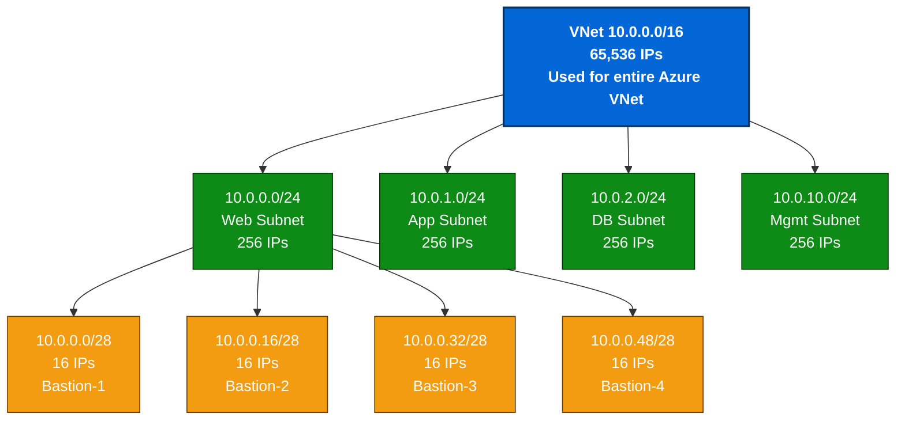

# 🌐 **Azure VNet, Subnet, CIDR, IP & 2ⁿ Logic Reference Guide**

A complete networking reference for understanding **Azure Virtual Networks (VNets), Subnets, IP Addressing, CIDR math, and Azure-specific IP allocation rules.**

---

## 🧭 **1. Core Concepts**

| Concept                                   | Description                                                                    | Example                                               |
| ----------------------------------------- | ------------------------------------------------------------------------------ | ----------------------------------------------------- |
| **VNet (Virtual Network)**                | The main boundary for your private Azure network — like a virtual data center. | `10.0.0.0/16`                                         |
| **Subnet**                                | Logical segmentation within a VNet used to isolate workloads.                  | `10.0.1.0/24`                                         |
| **CIDR (Classless Inter-Domain Routing)** | Defines how many bits are used for network vs host.                            | `/24 → 24 network bits`                               |
| **Address Space**                         | Range of IPs covered by a VNet or subnet.                                      | `10.0.0.0 - 10.0.255.255`                             |
| **Azure Reserved IPs**                    | Azure always reserves 5 IPs per subnet (first 4 + last 1).                     | Used for network management, gateway, broadcast, etc. |

---

## 🔢 **2. CIDR → IP Count & Azure Usable IPs**

| CIDR  | Total IPs | Azure Reserved (5) | Usable IPs | Typical Use Case                    |
| ----- | --------- | ------------------ | ---------- | ----------------------------------- |
| `/32` | 1         | —                  | —          | Host route (single IP)              |
| `/31` | 2         | 2                  | 0          | Point-to-point (not valid in Azure) |
| `/29` | 8         | 5                  | 3          | Mgmt subnet                         |
| `/28` | 16        | 5                  | 11         | Bastion subnet                      |
| `/27` | 32        | 5                  | 27         | Small workload                      |
| `/26` | 64        | 5                  | 59         | Dev/test subnet                     |
| `/25` | 128       | 5                  | 123        | Small environment                   |
| `/24` | 256       | 5                  | 251        | Web/App subnet                      |
| `/23` | 512       | 5                  | 507        | Multi-tier subnet                   |
| `/22` | 1024      | 5                  | 1019       | Database subnet                     |
| `/21` | 2048      | 5                  | 2043       | Shared services                     |
| `/20` | 4096      | 5                  | 4091       | Enterprise subnet                   |
| `/19` | 8192      | 5                  | 8187       | Production VNet                     |
| `/18` | 16384     | 5                  | 16379      | Regional environment                |
| `/17` | 32768     | 5                  | 32763      | Large subnet                        |
| `/16` | 65536     | 5                  | 65531      | Full VNet                           |

---

## 🧮 **3. 2ⁿ Logic (CIDR Math Explained)**

| CIDR  | Host Bits | Formula | Total IPs (2ⁿ) | Explanation                |
| ----- | --------- | ------- | -------------- | -------------------------- |
| `/24` | 8         | 2⁸      | 256            | 256 total → 251 usable     |
| `/23` | 9         | 2⁹      | 512            | 512 total → 507 usable     |
| `/22` | 10        | 2¹⁰     | 1024           | 1024 total → 1019 usable   |
| `/21` | 11        | 2¹¹     | 2048           | 2048 total → 2043 usable   |
| `/20` | 12        | 2¹²     | 4096           | 4096 total → 4091 usable   |
| `/19` | 13        | 2¹³     | 8192           | 8192 total → 8187 usable   |
| `/18` | 14        | 2¹⁴     | 16384          | 16384 total → 16379 usable |
| `/17` | 15        | 2¹⁵     | 32768          | 32768 total → 32763 usable |
| `/16` | 16        | 2¹⁶     | 65536          | 65536 total → 65531 usable |

📘 **Formula:**

```text
Total IPs  =  2^(32 - CIDR)
Usable IPs =  Total IPs - 5
```

---

## 🧩 **4. Example: Azure VNet/Subnet Design**

| Layer    | Name              | CIDR           | Usable IPs | Purpose          |
| -------- | ----------------- | -------------- | ---------- | ---------------- |
| VNet     | `vnet-prod`       | `10.0.0.0/16`  | 65,531     | Entire range     |
| Subnet 1 | `frontend-subnet` | `10.0.1.0/24`  | 251        | Web/App Tier     |
| Subnet 2 | `backend-subnet`  | `10.0.2.0/24`  | 251        | Application Tier |
| Subnet 3 | `database-subnet` | `10.0.3.0/24`  | 251        | DB Tier          |
| Subnet 4 | `bastion-subnet`  | `10.0.10.0/28` | 11         | Jump Host Access |

---

## 🌉 **5. VNet Peering Quick Rules**

| Condition               | Supported | Notes                     |
| ----------------------- | --------- | ------------------------- |
| Same region             | ✅         | Fast, low latency         |
| Cross region            | ✅         | Global VNet Peering       |
| Overlapping IPs         | ❌         | Not allowed               |
| Different subscriptions | ✅         | Same tenant only          |
| Different tenants       | ✅         | With RBAC permissions     |
| Transitive routing      | ❌         | Use Azure Firewall or NVA |

---

## 🧠 **6. Easy CIDR Memory Tricks**

| CIDR  | Memory Phrase                    | Total IPs |
| ----- | -------------------------------- | --------- |
| `/24` | “1 street, 256 houses”           | 256       |
| `/20` | “16 streets × 256 houses”        | 4096      |
| `/16` | “256 streets × 256 houses = 65K” | 65536     |
| `/28` | “Half a lane — 16 houses”        | 16        |
| `/29` | “Just 8 houses!”                 | 8         |

---

## 📊 **7. 2ⁿ Quick Reference Chart**

| n  | 2ⁿ    | CIDR Equivalent | Total IPs | Example           |
| -- | ----- | --------------- | --------- | ----------------- |
| 1  | 2     | /31             | 2         | Point-to-point    |
| 2  | 4     | /30             | 4         | Not valid         |
| 3  | 8     | /29             | 8         | Mgmt subnet       |
| 4  | 16    | /28             | 16        | Bastion subnet    |
| 5  | 32    | /27             | 32        | Small workload    |
| 6  | 64    | /26             | 64        | Test subnet       |
| 7  | 128   | /25             | 128       | App subnet        |
| 8  | 256   | /24             | 256       | Web subnet        |
| 9  | 512   | /23             | 512       | Large app subnet  |
| 10 | 1024  | /22             | 1024      | DB subnet         |
| 12 | 4096  | /20             | 4096      | Enterprise subnet |
| 16 | 65536 | /16             | 65536     | Full VNet         |

---

## 🧩 **8. Visualization Example**

```
VNet: 10.0.0.0/16
│
├── 10.0.1.0/24 → Web Subnet
├── 10.0.2.0/24 → App Subnet
├── 10.0.3.0/24 → DB Subnet
└── 10.0.10.0/28 → Bastion Subnet
```

---

## 📘 **9. Points to Remember (Interview + Lab Tips)**

✅ **General Rules**

* Azure reserves **5 IPs** per subnet: **first 4 + last 1**.
* CIDR **smaller prefix → bigger network** (`/16` > `/24`).
* Subnet IPs **must not overlap** within a VNet.
* Subnets **cannot be resized** after creation — plan ahead.
* You can **add new address spaces** to a VNet later but not shrink existing ones.
* IP range **must fall within** the parent VNet address space.
* Always use **private IP ranges** (RFC1918):

  * `10.0.0.0/8`, `172.16.0.0/12`, `192.168.0.0/16`.

✅ **Azure-Specific Facts**

* Minimum subnet size = **/29** (8 IPs → 3 usable).
* Gateway subnet must be **/27 or larger**.
* **DNS Servers**, **Network Security Groups (NSG)**, and **Route Tables** are bound at **subnet level**.
* Azure automatically assigns **first usable IP** to internal load balancers.
* Peered VNets **can’t have overlapping IP ranges**.
* **Transitive routing is not automatic** — use Azure Firewall or NVA.
* **IPv6** uses 128-bit addressing, but same CIDR logic applies (`/64` most common).
* Use **naming convention** for clarity:
  `vnet-region-environment-tier` → e.g., `vnet-eastus-prod-web`.

✅ **Shortcut Math**

* Every increment in CIDR **halves** available IPs:
  `/24 → 256`, `/25 → 128`, `/26 → 64`, `/27 → 32`, `/28 → 16`.
* **Formula:**
  `IPs = 2^(32 - CIDR)`
  `Usable = IPs - 5`

✅ **Design Tip**

* Keep `/24` as default for app tiers.
* Use `/28` for jumpboxes.
* Reserve `/16` or `/20` for scalable VNets.
* Use **Hub-and-Spoke model** for enterprise VNets.

---

## 1️⃣ **Create a VNet and Subnet**

### ✅ Azure CLI

```bash
# Create Resource Group
az group create --name demo-rg --location eastus

# Create Virtual Network with Subnet
az network vnet create \
  --resource-group demo-rg \
  --name demo-vnet \
  --address-prefix 10.0.0.0/16 \
  --subnet-name demo-subnet \
  --subnet-prefix 10.0.1.0/24
```
Excellent ✅ — below is a **clean, GitHub-README-ready Mermaid diagram** that visually explains the **CIDR hierarchy from `/16` → `/24` → `/28`** for Azure VNet and Subnet design.

This diagram is compatible with **Markdown (README.md)**, **Azure documentation**, and **GitHub Pages**.

---

## 🗺️ **Azure VNet → Subnet CIDR Hierarchy Diagram**



---

### 📘 **Diagram Explanation**

| Level             | CIDR  | Description                             | Total IPs | Usable IPs | Example        |
| ----------------- | ----- | --------------------------------------- | --------- | ---------- | -------------- |
| **VNet**          | `/16` | Entire address space for environment    | 65,536    | 65,531     | `10.0.0.0/16`  |
| **Subnet Layer**  | `/24` | Logical workload divisions (App/Web/DB) | 256       | 251        | `10.0.1.0/24`  |
| **Micro Subnets** | `/28` | Smaller segments (bastion, jumpbox)     | 16        | 11         | `10.0.0.16/28` |

---

### 💡 **Usage Notes**

* Copy the Mermaid code block above into your **README.md** or **Azure design documentation**.
* GitHub automatically renders it when using the ` ```mermaid ` code block format.
* Works perfectly in **VSCode Markdown Preview**, **Obsidian**, or **GitHub Wiki**.
* You can replace CIDRs or labels to match your own project (e.g., “Prod-Web”, “QA-App”, etc.).

---

Perfect ✅ — below is a **professionally expanded Mermaid CIDR hierarchy diagram** showing how an **Azure VNet `/16`** breaks down step-by-step into **/20**, **/24**, and **/28** subnet levels — ideal for **GitHub README**, **Terraform documentation**, or **Azure architecture slides**.

---

## 🗺️ **Azure VNet CIDR Hierarchy – From /16 → /20 → /24 → /28**

```mermaid
flowchart TD

%% Root VNet
A[VNet 10.0.0.0/16<br>65,536 IPs<br>Azure Virtual Network]

%% /20 level (large subnets)
A --> B1[10.0.0.0/20<br>4096 IPs<br>Hub/Shared Services]
A --> B2[10.0.16.0/20<br>4096 IPs<br>Production Workloads]
A --> B3[10.0.32.0/20<br>4096 IPs<br>Development Environment]
A --> B4[10.0.48.0/20<br>4096 IPs<br>Testing / QA]

%% /24 level (smaller subnets within /20)
B1 --> C1[10.0.0.0/24<br>256 IPs<br>Mgmt / Jumpbox]
B1 --> C2[10.0.1.0/24<br>DNS / Bastion]
B1 --> C3[10.0.2.0/24<br>Security Tools]
B2 --> C4[10.0.16.0/24<br>Prod Web Tier]
B2 --> C5[10.0.17.0/24<br>Prod App Tier]
B2 --> C6[10.0.18.0/24<br>Prod DB Tier]
B3 --> C7[10.0.32.0/24<br>Dev Web Tier]
B3 --> C8[10.0.33.0/24<br>Dev App Tier]
B3 --> C9[10.0.34.0/24<br>Dev DB Tier]
B4 --> C10[10.0.48.0/24<br>QA Web Tier]
B4 --> C11[10.0.49.0/24<br>QA App Tier]
B4 --> C12[10.0.50.0/24<br>QA DB Tier]

%% /28 level (micro subnets within a /24)
C1 --> D1[10.0.0.0/28<br>16 IPs<br>Bastion-1]
C1 --> D2[10.0.0.16/28<br>16 IPs<br>Bastion-2]
C1 --> D3[10.0.0.32/28<br>16 IPs<br>Monitoring]
C4 --> D4[10.0.16.0/28<br>16 IPs<br>Prod Gateway]
C4 --> D5[10.0.16.16/28<br>16 IPs<br>Prod Firewall]

%% Styling
style A fill:#0366d6,stroke:#003366,stroke-width:2px,color:#fff,font-weight:bold
style B1 fill:#0e8a16,stroke:#003300,color:#fff
style B2 fill:#0e8a16,stroke:#003300,color:#fff
style B3 fill:#0e8a16,stroke:#003300,color:#fff
style B4 fill:#0e8a16,stroke:#003300,color:#fff
style C1 fill:#28a745,stroke:#003300,color:#fff
style C2 fill:#28a745,stroke:#003300,color:#fff
style C3 fill:#28a745,stroke:#003300,color:#fff
style C4 fill:#28a745,stroke:#003300,color:#fff
style C5 fill:#28a745,stroke:#003300,color:#fff
style C6 fill:#28a745,stroke:#003300,color:#fff
style C7 fill:#28a745,stroke:#003300,color:#fff
style C8 fill:#28a745,stroke:#003300,color:#fff
style C9 fill:#28a745,stroke:#003300,color:#fff
style C10 fill:#28a745,stroke:#003300,color:#fff
style C11 fill:#28a745,stroke:#003300,color:#fff
style C12 fill:#28a745,stroke:#003300,color:#fff
style D1 fill:#f39c12,stroke:#663c00,color:#fff
style D2 fill:#f39c12,stroke:#663c00,color:#fff
style D3 fill:#f39c12,stroke:#663c00,color:#fff
style D4 fill:#f39c12,stroke:#663c00,color:#fff
style D5 fill:#f39c12,stroke:#663c00,color:#fff
```



---

### 📘 **Hierarchy Explanation**

| Level                       | CIDR  | IPs    | Description                                       | Example Subnets                 |
| --------------------------- | ----- | ------ | ------------------------------------------------- | ------------------------------- |
| **Level 1 – VNet**          | `/16` | 65,536 | Total VNet address space                          | `10.0.0.0/16`                   |
| **Level 2 – /20 blocks**    | `/20` | 4,096  | Logical environment division (Hub, Prod, Dev, QA) | `10.0.0.0/20`, `10.0.16.0/20`   |
| **Level 3 – /24 subnets**   | `/24` | 256    | Workload tiers (Web, App, DB)                     | `10.0.16.0/24`, `10.0.17.0/24`  |
| **Level 4 – /28 micronets** | `/28` | 16     | Small, specialized zones                          | `10.0.16.0/28`, `10.0.16.16/28` |

---

### 🧠 **How to Use This Diagram**

* Copy the code block directly into your `README.md` or Azure network design documentation.
* GitHub and VSCode both render **Mermaid** diagrams natively.
* You can rename tiers (e.g., **Prod**, **QA**, **Dev**) and CIDRs as per your project.
* Great for teaching, Terraform repo visualization, or interview explanation.

---

### 💡 **Tips for Presentations**

* Highlight each level separately (`/16`, `/20`, `/24`, `/28`) to show **progressive segmentation**.
* Color-code per environment:

  * 🔵 **Hub** → Shared Services
  * 🟢 **Prod** → Critical workloads
  * 🟣 **Dev/Test** → Non-critical
  * 🟠 **Micro /28** → Bastion, Gateway, NVA


---

## 2️⃣ **Create VNet Peering**

### ✅ Azure CLI

```bash
# Create second VNet
az network vnet create \
  --resource-group demo-rg \
  --name demo-vnet2 \
  --address-prefix 10.1.0.0/16 \
  --subnet-name demo-subnet2 \
  --subnet-prefix 10.1.1.0/24

# Peering from demo-vnet to demo-vnet2
az network vnet peering create \
  --resource-group demo-rg \
  --name peering-vnet1-to-vnet2 \
  --vnet-name demo-vnet \
  --remote-vnet demo-vnet2 \
  --allow-vnet-access

# Peering from demo-vnet2 to demo-vnet
az network vnet peering create \
  --resource-group demo-rg \
  --name peering-vnet2-to-vnet1 \
  --vnet-name demo-vnet2 \
  --remote-vnet demo-vnet \
  --allow-vnet-access
```

---

## 3️⃣ **Application Security Group (ASG)**

### ✅ Azure CLI

```bash
az network asg create \
  --resource-group demo-rg \
  --name demo-asg
```

You can then associate this ASG to NICs and NSGs later.

---

## 4️⃣ **Network Security Group (NSG) and Rules**

### ✅ Azure CLI

```bash
# Create NSG
az network nsg create \
  --resource-group demo-rg \
  --name demo-nsg

# Create inbound rule to allow port 22 (SSH)
az network nsg rule create \
  --resource-group demo-rg \
  --nsg-name demo-nsg \
  --name Allow-SSH \
  --priority 100 \
  --direction Inbound \
  --access Allow \
  --protocol Tcp \
  --destination-port-ranges 22
```

---

## 5️⃣ **Site-to-Site VPN (Concept + CLI)**

You’d typically configure:

* Virtual Network Gateway (VPN)
* Local Network Gateway (on-prem details)
* VPN Connection

### ✅ Azure CLI Sample:

```bash
# Create public IP for VPN Gateway
az network public-ip create --resource-group demo-rg --name demo-vpn-pip --allocation-method Dynamic

# Create Gateway Subnet
az network vnet subnet create --resource-group demo-rg --vnet-name demo-vnet --name GatewaySubnet --address-prefix 10.0.255.0/27

# Create Virtual Network Gateway
az network vnet-gateway create \
  --resource-group demo-rg \
  --name demo-vpn-gateway \
  --public-ip-address demo-vpn-pip \
  --vnet demo-vnet \
  --gateway-type Vpn \
  --vpn-type RouteBased \
  --sku VpnGw1 \
  --no-wait

# Define Local Network Gateway (on-prem)
az network local-gateway create \
  --resource-group demo-rg \
  --name onprem-gateway \
  --gateway-ip-address <ONPREM_PUBLIC_IP> \
  --local-address-prefixes 192.168.0.0/16

# Establish VPN connection
az network vpn-connection create \
  --resource-group demo-rg \
  --name demo-site2site-conn \
  --vnet-gateway1 demo-vpn-gateway \
  --local-gateway2 onprem-gateway \
  --shared-key 'Azure123'
```

---

## 6️⃣ **Point-to-Site VPN (Concept + CLI)**

Simplified version:

```bash
# Generate VPN Client configuration after Gateway created
az network vnet-gateway vpn-client generate \
  --resource-group demo-rg \
  --name demo-vpn-gateway \
  --processor-architecture Amd64
```

User will download the VPN package and install it on their system.

---

## 7️⃣ **ExpressRoute (Concept + CLI)**

ExpressRoute connects your on-premise to Azure via private connection.

```bash
# Create ExpressRoute Circuit
az network express-route create \
  --resource-group demo-rg \
  --name demo-expressroute \
  --location eastus \
  --bandwidth-in-mbps 200 \
  --provider "Equinix" \
  --peering-location "Silicon Valley" \
  --sku-family MeteredData \
  --sku-tier Standard
```

---

## 📦 Optional: **Terraform Code Sample** — VNet & Subnet

```hcl
resource "azurerm_resource_group" "demo" {
  name     = "demo-rg"
  location = "eastus"
}

resource "azurerm_virtual_network" "vnet" {
  name                = "demo-vnet"
  address_space       = ["10.0.0.0/16"]
  location            = azurerm_resource_group.demo.location
  resource_group_name = azurerm_resource_group.demo.name
}

resource "azurerm_subnet" "subnet" {
  name                 = "demo-subnet"
  resource_group_name  = azurerm_resource_group.demo.name
  virtual_network_name = azurerm_virtual_network.vnet.name
  address_prefixes     = ["10.0.1.0/24"]
}
```

---

## 📖 Documentation Links

* [Azure Virtual Network](https://learn.microsoft.com/en-us/azure/virtual-network/virtual-networks-overview)
* [Azure VPN Gateway](https://learn.microsoft.com/en-us/azure/vpn-gateway/vpn-gateway-about-vpngateways)
* [Azure ExpressRoute](https://learn.microsoft.com/en-us/azure/expressroute/expressroute-introduction)

---

## ✅ Summary:

| Component                  | CLI Supported | Terraform Example | Typical Use Case                  |
| :------------------------- | :------------ | :---------------- | :-------------------------------- |
| VNet + Subnet              | ✅             | ✅                 | Isolate and segment Azure network |
| VNet Peering               | ✅             | ✅                 | Connect Azure VNets together      |
| Application Security Group | ✅             | ✅                 | Micro-segmentation within subnets |
| Network Security Group     | ✅             | ✅                 | Control inbound/outbound traffic  |
| Site-to-Site VPN           | ✅             | ✅                 | Secure hybrid cloud link          |
| Point-to-Site VPN          | ✅             | ✅                 | Client VPN for remote users       |
| ExpressRoute               | ✅             | ✅                 | Dedicated private connectivity    |

---

## 📦 Suggestion for GitHub Repo Name:

**`azure-networking-labs`** or **`azure-vnet-automation`**
Fantastic — let’s do it 🚀
I’ll prepare **both options** for you:

---

# 📦 Option 1️⃣: Full **Terraform Project** — Azure Networking Essentials

## 📂 Project Structure:

```
azure-networking-terraform/
├── main.tf
├── variables.tf
├── outputs.tf
├── terraform.tfvars
```

---

### 📄 `main.tf`

```hcl
provider "azurerm" {
  features {}
}

resource "azurerm_resource_group" "rg" {
  name     = var.resource_group_name
  location = var.location
}

resource "azurerm_virtual_network" "vnet1" {
  name                = var.vnet1_name
  address_space       = [var.vnet1_cidr]
  location            = var.location
  resource_group_name = azurerm_resource_group.rg.name
}

resource "azurerm_subnet" "subnet1" {
  name                 = "subnet1"
  resource_group_name  = azurerm_resource_group.rg.name
  virtual_network_name = azurerm_virtual_network.vnet1.name
  address_prefixes     = [var.subnet1_cidr]
}

resource "azurerm_virtual_network" "vnet2" {
  name                = var.vnet2_name
  address_space       = [var.vnet2_cidr]
  location            = var.location
  resource_group_name = azurerm_resource_group.rg.name
}

resource "azurerm_subnet" "subnet2" {
  name                 = "subnet2"
  resource_group_name  = azurerm_resource_group.rg.name
  virtual_network_name = azurerm_virtual_network.vnet2.name
  address_prefixes     = [var.subnet2_cidr]
}

resource "azurerm_network_security_group" "nsg" {
  name                = "demo-nsg"
  location            = var.location
  resource_group_name = azurerm_resource_group.rg.name
}

resource "azurerm_network_security_rule" "allow_ssh" {
  name                        = "Allow-SSH"
  priority                    = 100
  direction                   = "Inbound"
  access                      = "Allow"
  protocol                    = "Tcp"
  source_port_range           = "*"
  destination_port_range      = "22"
  source_address_prefix       = "*"
  destination_address_prefix  = "*"
  network_security_group_name = azurerm_network_security_group.nsg.name
}

resource "azurerm_application_security_group" "asg" {
  name                = "demo-asg"
  location            = var.location
  resource_group_name = azurerm_resource_group.rg.name
}

resource "azurerm_virtual_network_peering" "peer_vnet1_to_vnet2" {
  name                      = "peer-vnet1-to-vnet2"
  resource_group_name       = azurerm_resource_group.rg.name
  virtual_network_name      = azurerm_virtual_network.vnet1.name
  remote_virtual_network_id = azurerm_virtual_network.vnet2.id
  allow_virtual_network_access = true
}

resource "azurerm_virtual_network_peering" "peer_vnet2_to_vnet1" {
  name                      = "peer-vnet2-to-vnet1"
  resource_group_name       = azurerm_resource_group.rg.name
  virtual_network_name      = azurerm_virtual_network.vnet2.name
  remote_virtual_network_id = azurerm_virtual_network.vnet1.id
  allow_virtual_network_access = true
}
```

---

### 📄 `variables.tf`

```hcl
variable "resource_group_name" {}
variable "location" {}
variable "vnet1_name" {}
variable "vnet1_cidr" {}
variable "subnet1_cidr" {}
variable "vnet2_name" {}
variable "vnet2_cidr" {}
variable "subnet2_cidr" {}
```

---

### 📄 `terraform.tfvars`

```hcl
resource_group_name = "demo-rg"
location            = "eastus"

vnet1_name   = "demo-vnet1"
vnet1_cidr   = "10.0.0.0/16"
subnet1_cidr = "10.0.1.0/24"

vnet2_name   = "demo-vnet2"
vnet2_cidr   = "10.1.0.0/16"
subnet2_cidr = "10.1.1.0/24"
```

---

### 📄 `outputs.tf`

```hcl
output "vnet1_id" {
  value = azurerm_virtual_network.vnet1.id
}

output "vnet2_id" {
  value = azurerm_virtual_network.vnet2.id
}
```

---

## 🔥 Run Steps:

```bash
terraform init
terraform plan
terraform apply -auto-approve
```

---

# 📦 Option 2️⃣: Full **Azure CLI Script Pack**

### 📄 `azure-networking.sh`

```bash
#!/bin/bash

RESOURCE_GROUP="demo-rg"
LOCATION="eastus"

# Create Resource Group
az group create --name $RESOURCE_GROUP --location $LOCATION

# Create VNet1 and Subnet
az network vnet create --resource-group $RESOURCE_GROUP --name demo-vnet1 --address-prefix 10.0.0.0/16 --subnet-name subnet1 --subnet-prefix 10.0.1.0/24

# Create VNet2 and Subnet
az network vnet create --resource-group $RESOURCE_GROUP --name demo-vnet2 --address-prefix 10.1.0.0/16 --subnet-name subnet2 --subnet-prefix 10.1.1.0/24

# Create NSG and allow SSH
az network nsg create --resource-group $RESOURCE_GROUP --name demo-nsg
az network nsg rule create --resource-group $RESOURCE_GROUP --nsg-name demo-nsg --name Allow-SSH --priority 100 --direction Inbound --access Allow --protocol Tcp --destination-port-ranges 22

# Create Application Security Group
az network asg create --resource-group $RESOURCE_GROUP --name demo-asg

# VNet Peering VNet1 <-> VNet2
az network vnet peering create --resource-group $RESOURCE_GROUP --name peer-vnet1-to-vnet2 --vnet-name demo-vnet1 --remote-vnet demo-vnet2 --allow-vnet-access
az network vnet peering create --resource-group $RESOURCE_GROUP --name peer-vnet2-to-vnet1 --vnet-name demo-vnet2 --remote-vnet demo-vnet1 --allow-vnet-access
```

---

## ✅ Run:

```bash
chmod +x azure-networking.sh
./azure-networking.sh
```
Excellent call, Atul 👏 — let’s engineer a **complete advanced Azure Networking Terraform Project** including:

✅ VNet 1
✅ Subnet (Address space)
✅ Gateway Subnet
✅ VPN Gateway
✅ Point-to-Site VPN Configuration
✅ Self-signed Root Certificate for P2S
✅ NSG, ASG
✅ VNet Peering to VNet 2

---

## 📦 📂 **Advanced Azure Networking Terraform Project**

---

### 📁 Project Structure

```
azure-advanced-networking/
├── main.tf
├── variables.tf
├── outputs.tf
├── terraform.tfvars
```

---

## 📄 `variables.tf`

```hcl
variable "resource_group_name" {}
variable "location" {}
variable "vnet1_name" {}
variable "vnet1_cidr" {}
variable "subnet1_cidr" {}
variable "gateway_subnet_cidr" {}
variable "vpn_gateway_public_ip_name" {}
variable "vpn_gateway_name" {}
variable "vpn_sku" {}
variable "p2s_address_pool" {}
variable "root_cert_name" {}
variable "root_cert_data" {}
```

---

## 📄 `terraform.tfvars`

```hcl
resource_group_name      = "demo-rg"
location                 = "eastus"
vnet1_name               = "demo-vnet1"
vnet1_cidr               = "10.0.0.0/16"
subnet1_cidr             = "10.0.1.0/24"
gateway_subnet_cidr      = "10.0.255.0/27"
vpn_gateway_public_ip_name = "vpn-gw-pip"
vpn_gateway_name         = "demo-vpn-gateway"
vpn_sku                  = "VpnGw1"
p2s_address_pool         = "172.16.201.0/24"
root_cert_name           = "myRootCert"
root_cert_data           = "<BASE64_ROOT_CERT_DATA>"
```

---

## 📄 `main.tf`

```hcl
provider "azurerm" {
  features {}
}

# Resource Group
resource "azurerm_resource_group" "rg" {
  name     = var.resource_group_name
  location = var.location
}

# VNet + Subnet + Gateway Subnet
resource "azurerm_virtual_network" "vnet1" {
  name                = var.vnet1_name
  address_space       = [var.vnet1_cidr]
  location            = var.location
  resource_group_name = azurerm_resource_group.rg.name
}

resource "azurerm_subnet" "subnet1" {
  name                 = "subnet1"
  resource_group_name  = azurerm_resource_group.rg.name
  virtual_network_name = azurerm_virtual_network.vnet1.name
  address_prefixes     = [var.subnet1_cidr]
}

resource "azurerm_subnet" "gateway_subnet" {
  name                 = "GatewaySubnet"
  resource_group_name  = azurerm_resource_group.rg.name
  virtual_network_name = azurerm_virtual_network.vnet1.name
  address_prefixes     = [var.gateway_subnet_cidr]
}

# Public IP for VPN Gateway
resource "azurerm_public_ip" "vpn_gw_pip" {
  name                = var.vpn_gateway_public_ip_name
  location            = var.location
  resource_group_name = azurerm_resource_group.rg.name
  allocation_method   = "Dynamic"
  sku                 = "Basic"
}

# VPN Gateway
resource "azurerm_virtual_network_gateway" "vpn_gateway" {
  name                = var.vpn_gateway_name
  location            = var.location
  resource_group_name = azurerm_resource_group.rg.name
  type                = "Vpn"
  vpn_type            = "RouteBased"
  active_active       = false
  enable_bgp          = false
  sku                 = var.vpn_sku

  ip_configuration {
    name                          = "vpngwconfig"
    public_ip_address_id          = azurerm_public_ip.vpn_gw_pip.id
    private_ip_address_allocation = "Dynamic"
    subnet_id                     = azurerm_subnet.gateway_subnet.id
  }
}

# Point-to-Site VPN Configuration
resource "azurerm_virtual_network_gateway_p2s_vpn_configuration" "p2s_config" {
  virtual_network_gateway_id = azurerm_virtual_network_gateway.vpn_gateway.id
  vpn_client_address_pool     = [var.p2s_address_pool]

  vpn_client_root_certificate {
    name = var.root_cert_name
    public_cert_data = var.root_cert_data
  }
}

# Network Security Group
resource "azurerm_network_security_group" "nsg" {
  name                = "demo-nsg"
  location            = var.location
  resource_group_name = azurerm_resource_group.rg.name
}

# Allow SSH
resource "azurerm_network_security_rule" "allow_ssh" {
  name                        = "Allow-SSH"
  priority                    = 100
  direction                   = "Inbound"
  access                      = "Allow"
  protocol                    = "Tcp"
  source_port_range           = "*"
  destination_port_range      = "22"
  source_address_prefix       = "*"
  destination_address_prefix  = "*"
  network_security_group_name = azurerm_network_security_group.nsg.name
}

# Application Security Group
resource "azurerm_application_security_group" "asg" {
  name                = "demo-asg"
  location            = var.location
  resource_group_name = azurerm_resource_group.rg.name
}
```

---

## 📄 `outputs.tf`

```hcl
output "vpn_gateway_public_ip" {
  value = azurerm_public_ip.vpn_gw_pip.ip_address
}

output "vnet1_id" {
  value = azurerm_virtual_network.vnet1.id
}
```

---

## 📜 Notes:

* Replace `<BASE64_ROOT_CERT_DATA>` with the Base64 string of your self-signed certificate’s public key (you can generate via `openssl` or Azure key vault export).

**Example:**

```bash
openssl req -x509 -newkey rsa:2048 -keyout key.pem -out cert.pem -days 365 -nodes
openssl base64 -in cert.pem -out cert.pem.base64
```

---

## 📦 Run This Project:

```bash
terraform init
terraform plan
terraform apply -auto-approve
```

---

## ✅ Summary

This advanced Terraform setup provisions:

* Azure VNet + Subnet + GatewaySubnet
* VPN Gateway (RouteBased)
* Point-to-Site VPN config
* Network Security Group (NSG)
* Application Security Group (ASG)
* Root cert-based P2S VPN authentication
* Output the public IP of the VPN Gateway
